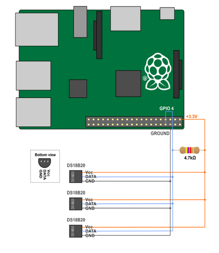

# RPI - Snake

set up for rpi zero 2w and two temp sensors, for monitering two snake enclosure temperatures  
keeps a record of temperature in influxdb and email out a warning if below 20degreesc heat i.e. bulb has blown  
RPI will automaticaly:  
▪️ update overnight  
▪️ take a temperature reading every 30 mins  
▪️ email out an alert every 6h if under 20 degrees c  

## prerequisites
- Raspberry pi Zero 2w
- DS18B20-Compatible Temperature Sensor x2
- gmail email address with app password set up  
        -https://github.com/01waltonad/rpi-snake/blob/main/images/pi-email-2022-update.pdf 

## RPI setup instructions
1) set up sensors as per diagram/image  

2) install Raspi os lite 64
3) install git on command line, clone files and run install script
    
        sudo apt install git -y && git clone https://github.com/01waltonad/rpi-snake.git && bash rpi-snake/Install.sh
       
> [!NOTE]
> ▪️Install script will create a database and set up email settings make a note of the settings used if planning on useing grafana  
> ▪️make sure to change 1-wire interface setting to enabled then reboot in raspi-config towards the end of the set up   
> ▪️make sure to reboot rpi to update settings

4) for the two sensors, make a note of the 1 wire folders starting with 28
   
        ls /sys/bus/w1/devices/
  
5) edit crontab files for your specification 
> [!NOTE]
> ▪️add in both file locations at the top  
> ▪️update influx username, password and database near the bottom  
> ▪️add in an email to send the alert to

6) run update_crontab to update crontab files

         bash rpi-snake/update_crontab.sh

## 3d print files
all the 3d prints i used are on thingiverse  
[Rpi zero case](https://www.thingiverse.com/thing:2823027)  
[cable tile mounts](https://www.thingiverse.com/thing:5180246)
